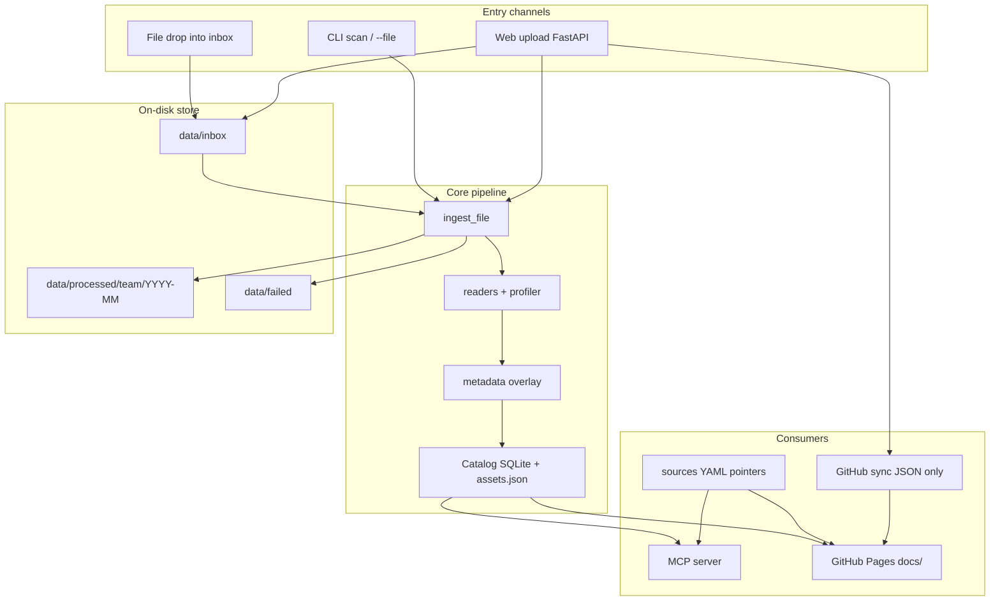
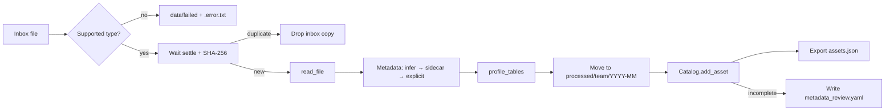
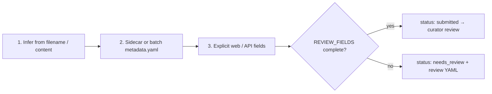
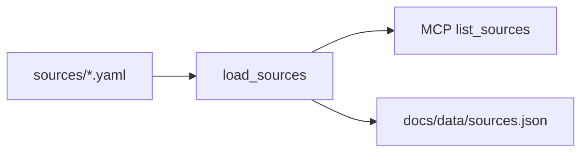
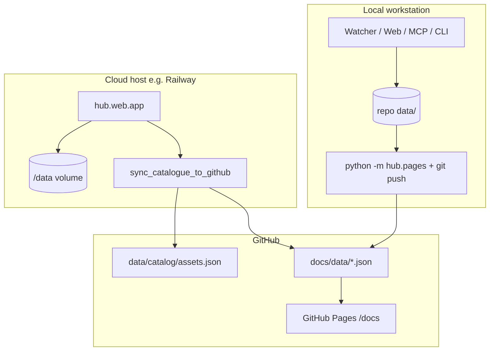

# ICRISAT Data Hub — Architecture & System Design

This document explains how the hub is designed end-to-end: purpose, components,
data flows, metadata rules, federation, and deploy modes. Use it to understand
the system or walk others through it.

---

## 1. Purpose and design philosophy

The ICRISAT Data Hub is a **federation-first** catalogue for team datasets.
Teams share files with almost no tooling; the hub reads, profiles, and registers
them; LLMs and a public dashboard consume the catalogue.

It follows the CGIAR Climate Data Hub (CDH) asset-mapping pattern:

```
submissions  →  ingest  →  normalised catalogue  →  publish
```

| CDH idea | Hub implementation |
|----------|--------------------|
| Submissions | Drop into `data/inbox/` or web upload |
| Normalised assets | SQLite `catalog.db` + `data/catalog/assets.json` |
| Publish | MCP tools for LLMs + GitHub Pages (`docs/data/*.json`) |

**Design principles**

1. **Low friction for teams** — drop a file, or drag-and-drop on a web form.
2. **One ingest path** — watcher, web, and CLI all call `hub.ingest.pipeline.ingest_file`.
3. **Federation over copy** — external APIs/datasets are YAML pointers under `sources/`, not duplicated into the hub.
4. **Catalogue is the product** — raw files stay on disk (or a host volume); what gets published is structured metadata + schema samples.
5. **MCP is read-only** — agents can list, preview, and SQL-query; they never mutate data.

---

## 2. System overview



**Mental model in one sentence:** files land in an inbox, one pipeline catalogues them, and MCP + Pages read that catalogue (plus federated source pointers).

---

## 3. Repository layout

```
config/hub.yaml          Hub-wide settings (paths, vocabulary, ports)
data/inbox/              Drop zone (watched)
data/processed/          Ingested files by team / YYYY-MM
data/failed/             Rejected files + .error.txt
data/catalog/            catalog.db (SQLite) + assets.json (export)
docs/                    Static GitHub Pages app + data/*.json
sources/                 YAML pointers to external data
src/hub/                 All runtime Python modules
tests/                   pytest (tmp fixtures only — never touches data/)
scripts/*.cmd            Windows launchers (set PYTHONPATH=src)
Dockerfile               Deployed web app; HUB_DATA_DIR=/data
```

### Core modules (`src/hub/`)

| Module | Responsibility |
|--------|----------------|
| `config.py` | `HubConfig`, `load_config()`, `HUB_DATA_DIR` path remap |
| `ingest/pipeline.py` | **Only** ingest entry: `ingest_file`, `scan_inbox`, `apply_review` |
| `ingest/readers.py` | CSV / Excel / Word readers + `detect_file_type` |
| `ingest/profiler.py` | Column profiles, samples, Word text preview |
| `ingest/metadata.py` | Infer, sidecars, review templates |
| `catalog.py` | SQLite catalogue; always exports `assets.json` |
| `watcher.py` | Filesystem watch on inbox → ingest / review |
| `web/app.py` | FastAPI: upload, review queue, dataset pages, sharing |
| `web/auth.py` | WorkOS AuthKit sign-in + signed session cookie (dev login locally) |
| `access.py` | Roles, curators per category, download rules, email/domain parsing |
| `notify.py` | Workflow emails via SMTP (logged when unset) |
| `mcp_server/server.py` | Read-only MCP tools (stdio or HTTP) |
| `sources.py` | Load/validate federation YAML pointers |
| `pages.py` | Export `docs/data/*.json` for the dashboard |
| `sync.py` | Deployed host pushes catalogue JSON to GitHub |

All `python -m hub...` commands need `PYTHONPATH=src` (the `.cmd` scripts set this).

---

## 4. End-to-end ingest pipeline

Every channel converges on one function: **`ingest_file`**.



### Step-by-step

1. **Arrive** — file appears in `data/inbox/` (watcher, web write, or CLI `--file` / `--scan`).
2. **Settle** — short wait so copies finish writing (`ingest.settle_seconds`).
3. **Type check** — `.csv`, `.xlsx`/`.xls`, `.docx` only; else quarantine under `data/failed/`.
4. **Dedup** — content SHA-256; if already catalogued, discard the inbox copy.
5. **Read** — Excel → one table per sheet; CSV → one table; Word → text + embedded tables.
6. **Metadata overlay** — infer, then sidecar, then web-form fields (later wins).
7. **Profile** — dtypes, null counts, sample values (and text preview for Word).
8. **Store** — move (default) or copy into `data/processed/<team>/<YYYY-MM>/`.
9. **Catalogue** — insert asset + tables; status `published` or `needs_review`.
10. **Export** — every catalogue write refreshes `data/catalog/assets.json`.

### Entry channels

| Channel | How it works |
|---------|----------------|
| **Watcher** | `hub.watcher` uses watchdog on `data/inbox/`; reviews `*_metadata_review.yaml`, ignores bare sidecars, ingests data files |
| **Web** | Signed-in upload streams to `data/staging/` (not the watched inbox), then `ingest_file(..., extra_metadata=...)` with the uploader's verified email as `owner_email` |
| **CLI** | `python -m hub.ingest.pipeline --scan` or `--file path` |

Do not add a second ingest implementation for a new channel — call `ingest_file`.

---

## 5. Metadata model

Metadata is layered so teams can do nothing, do a little, or fill a full form.



**Required before review** (`REVIEW_FIELDS`): `team`, `owner`, `description`, `license`, `access`, `category` (+ `access_reason` when restricted).

### Review and access (web app)

```
needs_review ─complete─▶ submitted ─publish─▶ published ─withdraw─▶ withdrawn
                             │  ▲                          (publish again)
                     return  ▼  │ submit
                           returned
```

- Curators are configured per category in `hub.yaml` → `access_control`; admins curate all.
- Every transition, edit, grant and revoke is an `events` row (audit + comment thread).
- Download levels: open (anyone), internal (`org_domains` emails), restricted (grants: email or `@domain`, optional expiry; access requests accept/decline). Metadata of published assets is always visible.
- Personal data forces `restricted`; embargoes (≤12 months) lift automatically.
- Public outputs (Pages JSON, `/api/assets` data, HTTP MCP) carry published + open assets only.
- Admin page: categories, curators and admins stored in SQLite (`roles`, `categories`) on top of hub.yaml; config admins can't be removed from the UI.
- Personal API tokens (`api_tokens`, hashed) let scripts `POST /upload` and download with `Authorization: Bearer`.
- Downloads are logged as `events`; owners/curators get an access-report CSV per dataset.

**Optional / useful fields:** `title`, `contact`, `domain`, `hub_role`, `spatial_coverage`, `temporal_coverage`, `tags`.

### Sidecars

Per file (preferred for a single dataset):

```
my_dataset.xlsx
my_dataset.meta.yaml
```

Or one batch file `metadata.yaml` keyed by filename. Per-file sidecar overrides batch.

### Review loop

Incomplete assets get `{asset_id}_metadata_review.yaml` next to the processed file.
Edit it and drop it back in the inbox (or use `--review`). `apply_review` updates
the catalogue and re-exports `assets.json`.

### Upload channel stamp

Each asset records how it was completed: `inbox` | `sidecar` | `web` — used for
dashboard analytics, not access control.

---

## 6. Catalogue design

The catalogue is the normalised heart of the system (CDH’s `assets.json` analogue).

| Layer | Role |
|-------|------|
| **SQLite** `data/catalog/catalog.db` | Authoritative runtime store (`assets`, `tables`) |
| **JSON** `data/catalog/assets.json` | Auto-exported snapshot after every change |
| **Pages JSON** `docs/data/*.json` | Static copy for GitHub Pages |

**Invariant:** all writes go through `hub.catalog.Catalog`. `add_asset` and
`update_metadata` always call `export_json()`.

An asset record typically includes identity, descriptive metadata, file location,
hash, status, tags, and nested table schemas (column names, dtypes, samples).

---

## 7. Federation (external sources)

Local files are **ingested** (copied into `processed/`). External systems are
**registered**, not copied.



Each pointer needs at least: `id`, `title`, `type`, `url`.

Types: `remote_dataset` | `api` | `database` | `file_share`.

Secrets stay in environment variables (`auth_env_var` names the env key; credentials
never live in YAML). Schema details: `sources/README.md` and the docstring in
`src/hub/sources.py` (keep both in sync if the schema changes).

---

## 8. Consumers

### 8.1 MCP server (LLMs)

`hub.mcp_server.server` exposes read-only tools:

| Tool | Purpose |
|------|---------|
| `list_assets` | Filter by status / team / type / tag |
| `search_assets` | Keyword over titles, descriptions, columns, doc text |
| `get_asset` | Full metadata + schema |
| `preview_asset` | First N rows (capped) |
| `query_asset` | Read-only SQL via DuckDB (SELECT/WITH; row cap) |
| `read_document` | Word text preview |
| `list_sources` | Federated YAML pointers |
| `get_catalog_summary` | Portfolio counts |

Transports: **stdio** (Claude Desktop / local agents) or **HTTP** (`--http`, port 8100).

### 8.2 GitHub Pages dashboard

Static app under `docs/` reads:

- `docs/data/assets.json` — catalogue
- `docs/data/sources.json` — federation pointers
- `docs/data/summary.json` — portfolio stats

Refresh locally:

```bat
set PYTHONPATH=src
.venv\Scripts\python -m hub.pages
```

Then commit `docs/data/*.json` (and usually `data/catalog/assets.json`). A GitHub
Action can regenerate Pages data when the catalogue or sources change on the
configured branch. Live site: https://henokd11.github.io/icrisat-data-hub/

**Important:** Pages shows catalogue metadata, not private raw Excel/CSV contents.
Sensitive columns must be removed from the **stored** file before ingest if they
must never appear in profiles or MCP queries.

### 8.3 Deployed GitHub sync

When the web app runs with `GITHUB_TOKEN` + `GITHUB_REPO`, successful uploads
trigger `hub.sync`: regenerate Pages JSON and push **only** catalogue JSON paths
to GitHub. Raw uploads never leave the host volume.

---

## 9. Configuration and paths

Central config: [`config/hub.yaml`](config/hub.yaml).

- Paths are relative (`data/inbox`, …) and resolved via `HubConfig.path(...)`.
- **Never hardcode absolute data paths** in code.
- Vocabulary lists (`access`, `domains`, `hub_role`) live in config for consistency.

### Deployed path remap

If `HUB_DATA_DIR` is set (Docker default `/data`), any configured path that starts
with `data/` is remapped onto that volume. Repo code and `sources/` stay in the
image; mutable state lives on the volume.

| Mode | Data location | Web port |
|------|---------------|----------|
| Local | `<repo>/data/...` | `hub.yaml` → 8010 |
| Docker / cloud | `HUB_DATA_DIR` volume | host `PORT` |

---

## 10. Supported file types and extension points

**Phase 1**

| Extension | Type | Reader behaviour |
|-----------|------|------------------|
| `.csv` | csv | Single table |
| `.xlsx`, `.xls` | excel | One table per non-empty sheet |
| `.docx` | word | Extracted text + embedded tables |

**To add a new type**

1. Add a reader in `src/hub/ingest/readers.py`.
2. Register it in `detect_file_type` / `read_file`.
3. Add the extension to `config/hub.yaml` → `ingest.supported_extensions`.
4. Add pytest coverage under `tests/` (tmp fixtures only).

---

## 11. Local vs deployed architecture



**Deploy checklist (summary)**

1. Dockerfile runs `hub.web.app` with `HUB_DATA_DIR=/data`.
2. Mount a persistent volume at `/data`.
3. Configure WorkOS sign-in (`WORKOS_API_KEY`, `WORKOS_CLIENT_ID`, `HUB_BASE_URL`, `HUB_SECRET_KEY`) — see README.
4. Optionally set `GITHUB_TOKEN`, `GITHUB_REPO`, `GITHUB_BRANCH` so uploads refresh the dashboard.
5. Dockerfile / `.dockerignore` keep local catalogue state out of the image.

---

## 12. Design invariants (do not break)

1. **`PYTHONPATH=src`** for all `python -m hub...` invocations.
2. **Paths via `HubConfig.path(...)`** — no hardcoded absolute data paths.
3. **One ingest path:** `hub.ingest.pipeline.ingest_file` only.
4. **Catalogue writes through `Catalog`** — always auto-export `assets.json`.
5. **Metadata order:** infer → sidecar → explicit; incomplete → `needs_review`.
6. **YAML pointer schema** documented in both `sources.py` and `sources/README.md`.
7. **Deployed sync pushes JSON only** — never raw uploaded files.
8. **MCP never mutates data;** `query_asset` is read-only SELECT with a row cap.
9. **Tests never touch `data/`** — they build fixtures in temporary directories.

---

## 13. How to explain it in 60 seconds

> ICRISAT teams drop CSV, Excel, or Word into an inbox (or use a simple web
> upload). One ingest pipeline reads the file, layers metadata, profiles columns,
> and registers an asset in a SQLite catalogue that always exports `assets.json`.
> Incomplete metadata is flagged for review. External datasets are registered as
> YAML pointers without copying them. LLMs discover and query the catalogue
> through a read-only MCP server; a static GitHub Pages dashboard shows the same
> portfolio from JSON exports. In the cloud, uploads stay on a private volume and
> only catalogue JSON is synced back to GitHub.

---

## 14. Quick command reference

| Task | Command |
|------|---------|
| Watch inbox | `scripts\start_watcher.cmd` |
| Scan inbox once | `set PYTHONPATH=src && .venv\Scripts\python -m hub.ingest.pipeline --scan` |
| Web app | `scripts\start_web.cmd` → http://localhost:8010 |
| MCP stdio / HTTP | `scripts\start_mcp_stdio.cmd` / `scripts\start_mcp_http.cmd` |
| Validate sources | `set PYTHONPATH=src && .venv\Scripts\python -m hub.sources` |
| Refresh Pages JSON | `set PYTHONPATH=src && .venv\Scripts\python -m hub.pages` |
| Tests | `set PYTHONPATH=src && .venv\Scripts\python -m pytest tests -q` |

---

## Related docs

- [`README.md`](README.md) — setup, team how-to, deploy steps
- [`AGENTS.md`](AGENTS.md) — agent/contributor conventions
- [`sources/README.md`](sources/README.md) — federation YAML schema
- [`config/hub.yaml`](config/hub.yaml) — paths, vocabulary, ports
